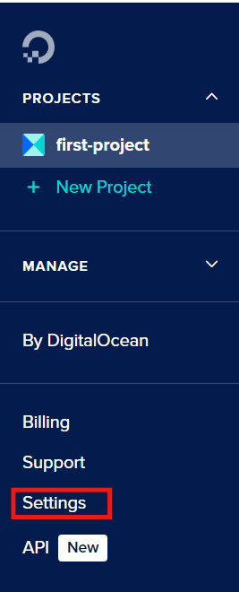

# Assignment 1
## Digital ocean server set up
login into digital ocean in your web browser and navigate to your first-project.
> First-project is just what I called my project. Your project can be called whatever you want.
> 
> Just make sure that you are clicking the same place as me.


This project section will be where we store our droplet.

>### Arch linux image
>If you already have a recent image, please continue past this step.
>
>If you do not already have an arch linux image, [click here](https://gitlab.archlinux.org/archlinux/arch-boxes/-/packages/).
>
>click on the most recent folder. In my case it is this one.
>
>
>
>Once inside the folder, scroll down until you find an Arch-Linux file, with file extension ".qcow2". This is the arch linux image you want.
>
>The image will be close to 500 MiB in size.
>
>

### SSH keygen

Leave digital ocean the way it is and minimize your web browser. Open your terminal.

I am on a windows OS, so I will be using powershell.

>If you can't locate your terminal open your file or system search tool and type "terminal".

Change "digo-key" to what you want to name your ssh key. 

Change "your email" to your email address or your name.

- -t specifies the type of encryption algorithm we want to use.
- -f specifies the file name. 
- -C is a comment that will be attached to the ssh key.

>**Don't change the encryption or make it blank.** 
>
>unspecified encryption will just turn into RSA encryption.
>
>We want to use ed25519 over the default RSA encryption.

Copy the following command into your terminal:

```
ssh-keygen -t ed25519 -f ~/.ssh/digo-key -C "your email or name"
```


>Once you get to this screen I recommend just pressing enter for no pass phrase.
>
>This is because you will need to enter it every time you login using ssh.
>
>If you do choose to use a passphrase I recommend writing it down.


>
>SSH key generation may not always work when using powershell. This is beacuse windows may not view the tilde (~) as the user's home directory.
>
>If your key generation failed and you are in powershell.
>
>Copy the following command and try again, remember to change "user name" to your user name.

```
ssh-keygen -t ed25519 -f C:\Users\user name\.ssh\digo-key -C "your email or name"
```

>If you get "failed" it might mean that the .ssh directory or folder does not exist.
>
>Open the file explorer. This is called finder on Mac. For linux it may depend on your distribution.
>
>For windows;
>
>
>
>Copy and paste the following line into the area left from search. Make sure you change "user name" to your user name.
>
>make a folder called ".ssh" inside your username folder.
>
>Try to generate your ssh keys again.

```
C:\Users\user name
```

>For MacOS, open finder and do `shift` + `command` + `G`.
>
>Copy and paste the following line into the search pop up.
>
>change "user name" to your user name.
>
>make a folder in your username folder and call it ".ssh".
>
>Try to generate your ssh keys again.
```
~/user name
```

After you enter your pass phrase, (empty for no passphrase) your public and private ssh keys should be generated.

### Public and Private keys

Close your terminal and open the file explorer.

For windows copy and paste the following into the area left from search. Make sure to change "user name".

```
C:\Users\user name\.ssh
```

For Mac open finder and do `shift` + `command` + `G` again.

Then copy and paste the following.

```
~/user name/.ssh
```

When you access your .ssh folder, you should be able to see digo-key and digo-key.pub.


The key we want to get right now is digo-key.pub. Right click on the "digo-key.pub" file and click open with visual studio code.

Once you are inside visual studio code. Copy the text in the file and close visual studio code.

### Security with SSH

Open your web browser again. You should be inside your project section in Digital Ocean.

We are going to add the public ssh key you just copied.

Go to settings.



Now go to security.


Click the "Add SSH Key" button and fill out the text fields under "New SSH Key".

This will allow us to connect to our droplet with ssh.

Although it is possible to connect to our droplet using a password. It is very risky. Our server (droplet) becomes vulnerable to hacking.

With ssh it is much harder to hack into our droplet. To connect to our server remotely, the public and private key have to match.

This means that if someone without our private key tried to break into oour server they would be denied access.

### Upload Arch image

On the far left side of the screen, click Backups & Snapshots under "Manage".


Click on "Custom Images". You should see a big blue button called "Upload Image".

Click it. The button should open a pop up of your file explorer. Go to your downloads section and select the arch linux image. Then add the image.

Under **Distribution** choose "Arch Linux".

under **Choose a datacenter region** choose San Francisco 3.

Upload the image.

Wait for the image to finish pending. This may take a bit of time. Please be patient.

### Making a droplet

Now that we have an ssh key and an image. Lets make the droplet.

Click on the create button at the top of the screen.


Click droplets.

This should take you to the "Create Droplets" section.

First choose San Francisco for the **Region**.

choose SFO3 under **Datacenter**. This is the datacenter we will be using since it is the closest one to Vancouver.

Scroll down to **Choose an image**.

Click "Custom images". Choose the image we just uploaded.

Under choose **Choose Size**. I recommend selecting **basic**, the **Dedicated CPU** option is far too excessive for our use case and will be far more costly.

Scroll down to **CPU options**. Any CPU configuration is fine, just make sure it is within your budget. I recommend regular for USD$6/month.

Keep scrolling until you reach **Choose Authentication Method**. Click on the **SSH Key** method and select your ssh key.

finally scroll to **Finalize Details**. under **Quantity** make sure you are only making **one** droplet.

Under **Hostname**, change the hostname to something easier to remember. I recommend something like buddy or pal.

Under **Project** make sure it is going to your project.

Create the droplet.

It will take sometime to finalize.

Once your droplet is finalized. Copy the IP address.

You can do this by hovering over the droplet and clicking copy next to the IP address.


### Connecting to the droplet

Open your terminal.

Copy and paste the following line into your terminal. Make sure to change "droplet-ip" to your droplets IP.

```
ssh -i .ssh/digo-key arch@droplet-ip
```
ssh = command to provide a secure connection.

-i .ssh/digo-key = path to the private key. The private key will try to connect to the server at the given ip.

arch = user of the system.

Once you enter the command your terminal will ask **Are you sure you want to continue connecting (yes/no/ fingerprint )?**.

Type yes.

If you chose to use a password to connect with your ssh key. You will be asked to use it now.

To logout of the connection simply type `exit`.

## Resources
**in MLA or APA format**
